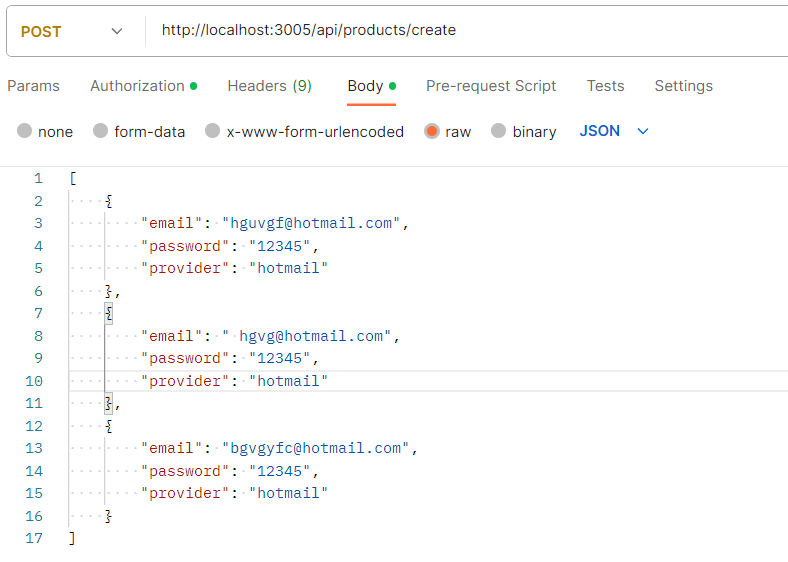

# Install app
## Front-end
### Install
#### Download source code from github
Use `git clone` to download source from git
#### `git clone https://github.com/nghia20ns/user-front-end.git`

#### `npm install`
When you run `npm install`, npm will read the `package.json` file in your project directory to find a list of packages that need to be installed. It will then download and install these packages from the npm repository and save them to the node_modules folder in your project. This helps you manage your project's dependencies and libraries efficiently.

#### `npm start`
Runs the app in the development mode.
Open http://localhost:3000 to view it in your browser.

The page will reload when you make changes.
You may also see any lint errors in the console.

#### `npm run build`

Builds the app for production to the `build` folder.\
It correctly bundles React in production mode and optimizes the build for the best performance.

The build is minified and the filenames include the hashes.\
Your app is ready to be deployed!

See the section about [deployment](https://facebook.github.io/create-react-app/docs/deployment) for more information.

### Structure and user interface
The application consists of 2 parts, the client interface and the admin interface
#### The admin interface
including `dashboard` page, `user manager` page, `account manager` page and `order` page

##### Dashboard
used to show app overview like revenue, users, products,...
##### User manager page
User management such as: add, edit, delete user 
##### Account manager
Account management such as: add, edit, delete account 
##### Order page
show details about the status and data of transactions

#### The client interface
including `home` page, `about` page, `information` page and `cart` page

## Back-end
### Install
#### Download source code from github
Use `git clone` to download source from git
#### `git clone https://github.com/nghia20ns/user-front-end.git`

#### `npm install`
When you run `npm install`, npm will read the `package.json` file in your project directory to find a list of packages that need to be installed. It will then download and install these packages from the npm repository and save them to the node_modules folder in your project. This helps you manage your project's dependencies and libraries efficiently.

#### `npm start`
Runs the app in the development mode.
Open http://localhost:3005 to view it in your browser.

The page will reload when you make changes.
You may also see any lint errors in the console.
### The process of how the back-end handles a request is as follows
When the front-end sends a request to the back-end, it goes through the following steps:
1. The request is sent from the front-end to the back-end's route handler (router).
2. Subsequently, the request passes through a middleware to authenticate the user. If the user fails authentication, they are redirected to the login page to log in again.
3. Next, the request reaches the controller to fetch the necessary data.
4. The controller forwards the request to a service to process the data. This service retrieves data from the database and performs required processing.
5. Finally, once the processing is complete, the data is sent back to the front-end through a response from the back-end.
   
### Add product
use api: `http://localhost:3005/api/products/create`
# front-end-1


